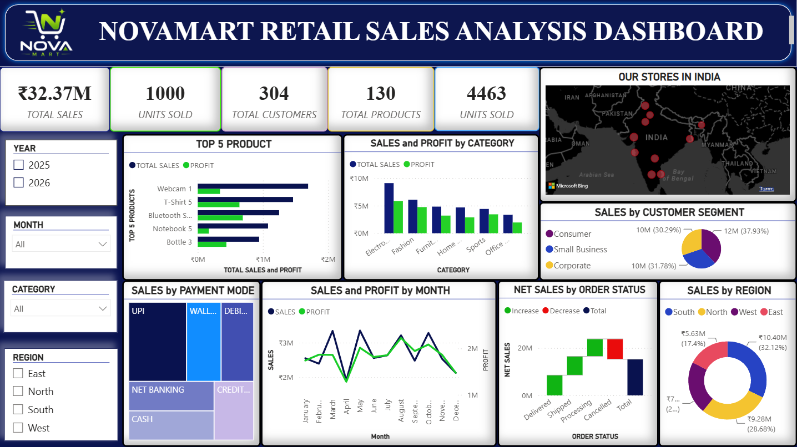

# NovaMart Retail Sales Analysis Dashboard



## 📊 Project Overview

This project presents an interactive **Power BI dashboard for NovaMart retail sales analysis**.

The dashboard provides a visual overview of sales performance and helps analyze key business metrics across the available sales data.

## 🎯 Dashboard

The Power BI dashboard includes visual analysis of:

* Sales performance
* Profit performance
* Profit margin
* Orders
* Product and category performance
* Regional sales performance
* Customer and sales trends

## 🛠️ Tools Used

* **Power BI**
* **Power Query**
* **DAX**
* **Data Visualization**

## 📁 Project Files

| File                                  | Description                                  |
| ------------------------------------- | -------------------------------------------- |
| `NovaMart_Retail_Sales_Analysis.pbix` | Power BI dashboard and analysis              |
| `NovaMart_Retail_Sales_Dashboard.png` | Dashboard preview                            |
| `NovaMart_Retail_Sales_Data.xlsx`     | Original Excel dataset used for the analysis |


## 🚀 How to View

1. Download `NovaMart_Retail_Sales_Analysis.pbix` from this repository.
2. Open the file using **Microsoft Power BI Desktop**.
3. Interact with the dashboard visuals and filters to explore the available sales and profitability analysis.
4. Use `NovaMart_Retail_Sales_Dashboard.png` for a quick preview of the dashboard without opening Power BI.

## 📌 Project Purpose

The purpose of this project is to transform retail sales data into an interactive business dashboard that makes sales and profitability information easier to analyze and understand.

## 💡 Key Insights

The dashboard provides an interactive view of NovaMart's retail sales performance and supports analysis of:

* Overall sales and profitability performance
* Profit margin and order-level performance
* Product and category-level results
* Regional sales performance
* Customer and sales trends
* Business performance through interactive Power BI visualizations

These insights can help identify areas of strong performance and support data-driven retail business decisions.

## 🧰 Skills & Techniques Demonstrated

* Data visualization and dashboard design
* Business intelligence reporting
* KPI development and analysis
* Interactive filtering and data exploration
* Sales and profitability analysis
* Power Query for data preparation
* DAX for analytical calculations
* Power BI data modeling and visualization

## 📂 Project Structure

```text
NovaMart-Retail-Sales-Dashboard/
│
├── NovaMart_Retail_Sales_Analysis.pbix
├── NovaMart_Retail_Sales_Dashboard.png
├── NovaMart_Retail_Sales_Data.xlsx
├── README.md
└── .gitignore
```

### File Description

* **`.pbix`** — Power BI dashboard containing the analysis and visualizations
* **`.png`** — Static preview of the completed dashboard
* **`.xlsx`** — Original Excel dataset used for the analysis
* **`README.md`** — Project documentation and overview
* **`.gitignore`** — Prevents unnecessary local files from being committed

## ⭐ Project Highlights

* Built an interactive retail sales dashboard using Power BI
* Presented sales, orders, profit, and margin metrics through visual reporting
* Enabled analysis across products, categories, regions, and customers
* Applied data preparation and analytical techniques using Power Query and DAX
* Designed a business-focused dashboard to support data-driven decision-making

## 📊 Data Source

The dashboard was developed using the included Excel dataset:

`NovaMart_Retail_Sales_Data.xlsx`

The dataset serves as the source data for the retail sales analysis presented in the Power BI dashboard.

